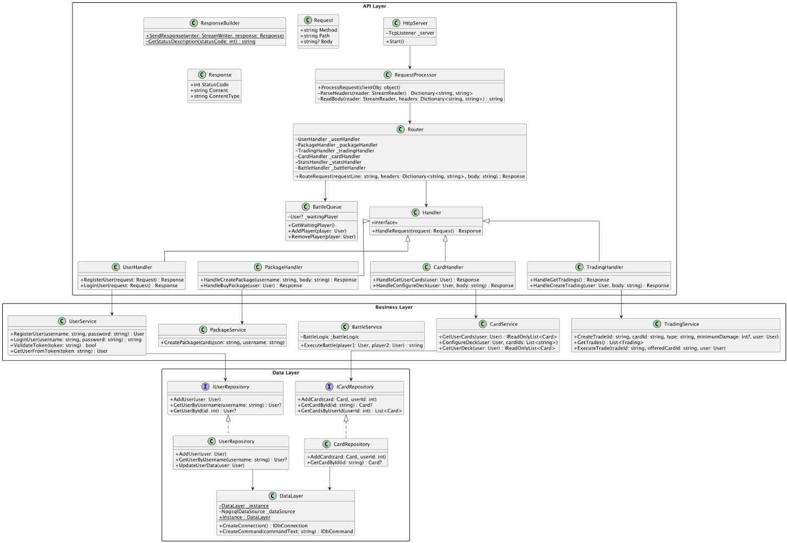

# Monster Trading Card Game

## Overview

This project is the final version of the Monster Trading Card Game, a server-based card trading and battling game implemented in C#. The project features a fully functional HTTP server with complete implementation of user management, card trading, deck building, and battle mechanics. Using a custom REST API and PostgreSQL database, players can engage in strategic card battles, trade cards with other players, and compete in an ELO-based ranking system.

## Core Features

### User Management

- Registration and authentication system
- Token-based security for protected endpoints
- Profile management (name, bio, image)
- Virtual currency system (20 coins per user)
- ELO-based statistics (starting at 100, +3 for win, -5 for loss)

### Card Management
Cards are divided into two main categories:

1. Monster Cards:

- Active attacks with element-based damage
- Special monster types: Dragon, Goblin, Wizzard, Ork, Knight, Kraken, FireElf
- Element types: Fire, Water, Normal


2. Spell Cards:

- Element-based spells (Fire, Water, Normal)
- Effectiveness rules:
  - Water -> Fire (2x damage)
  - Fire -> Normal (2x damage)
  - Normal -> Water (2x damage)
  - Reverse matchups deal half damage

### Package System

- Each package contains 5 cards
- Cost: 5 virtual coins
- Users start with 20 coins (enough for 4 packages)

### Battle System

- Random card selection from deck (4 cards)
- Special card interactions:
    - Goblins cannot attack Dragons
    - Wizzards control Orks
    - Knights drown instantly against WaterSpells
    - Kraken is immune to spells
    - FireElves can evade Dragon attacks
- Battle ends after maximum 100 rounds
- Card ownership changes upon defeat


### Trading System

- Card trading marketplace
- Requirements-based trading (type/minimum damage)
- Cards in deck cannot be traded

## Technical Stack

- C# (.NET 8.0)
- Custom HTTP server implementation
- PostgreSQL Database
- JSON serialization with Newtonsoft.Json

## Project Structure

```
MonsterTradingCardGame/
├── API/
│   └── Server/          # Custom HTTP server implementation
│   └── DTOs/            # Data transfer objects
│   └── Handlers/        # Request handlers
├── Business/
│   ├── Logic/           # Game and battle logic
│   ├── Factories/       # Card creation
│   └── Services/        # Business operations
├── Data/
│   └── Repositories/    # Database interactions
└── Domain/
    └── Models/          # Game entities
```

### Overview




### API Layer

## API Endpoints

### Authentication
- POST /users - Register
- POST /sessions - Login

### User Management
- GET /users/{username} - Get user data
- PUT /users/{username} - Update user data
- GET /stats - Get user stats
- GET /scoreboard - View scoreboard

### Cards & Packages
- POST /packages - Create package (admin)
- POST /transactions/packages - Buy package
- GET /cards - Show user cards
- GET /deck - Show deck
- PUT /deck - Configure deck

### Trading
- GET /tradings - Show trading deals
- POST /tradings - Create trade
- DELETE /tradings/{id} - Delete trade
- POST /tradings/{id} - Execute trade

### Battle
- POST /battles - Enter battle

### Business Layer


### Domain Layer


## Database Structure


### Users Table
```sql
CREATE TABLE users (
    id           integer PRIMARY KEY,
    username     varchar(50),
    password_hash varchar(255),
    coins        integer DEFAULT 20,
    created_at   timestamp DEFAULT CURRENT_TIMESTAMP,
    display_name varchar(255),
    bio          text,
    image        text
);
```

### Cards Table
```sql
CREATE TABLE cards (
    id           varchar(36) PRIMARY KEY,
    name         varchar(255),
    damage       integer,
    element_type varchar(50),
    package_id   integer,
    user_id      integer,
    in_deck      boolean DEFAULT false,
    created_at   timestamp DEFAULT CURRENT_TIMESTAMP,
    in_stack     boolean DEFAULT true
);
```

### Packages Table
```sql
CREATE TABLE packages (
    id           integer PRIMARY KEY,
    price        integer DEFAULT 5,
    user_id      integer,
    created_at   timestamp DEFAULT CURRENT_TIMESTAMP,
    acquired_at  timestamp
);
```

### Sessions Table
```sql
CREATE TABLE sessions (
    token       varchar(255) PRIMARY KEY,
    user_id     integer,
    created_at  timestamp,
    expires_at  timestamp
);
```

### Stats Table
```sql
CREATE TABLE stats (
    id            integer PRIMARY KEY,
    user_id       integer,
    games_played  integer DEFAULT 0,
    games_won     integer DEFAULT 0,
    games_lost    integer DEFAULT 0,
    elo           integer DEFAULT 100,
    created_at    timestamp DEFAULT CURRENT_TIMESTAMP,
    updated_at    timestamp DEFAULT CURRENT_TIMESTAMP
);
```

### Tradings Table
```sql
CREATE TABLE tradings (
    id              varchar(36) PRIMARY KEY,
    card_to_trade   varchar(36),
    type           varchar(50),
    minimum_damage  integer,
    user_id        integer,
    created_at     timestamp DEFAULT CURRENT_TIMESTAMP
);
```

### Key Relationships
- Cards reference packages through `package_id`
- Cards reference users through `user_id`
- Stats reference users through `user_id`
- Sessions reference users through `user_id`
- Tradings reference users through `user_id`
- Tradings reference cards through `card_to_trade`


## Getting Started

### Database Setup
1. Install PostgreSQL if not already installed
2. Create a new database:
```sql
CREATE DATABASE mydb;
```
3. Execute the following SQL scripts in order:
```sql
-- Create tables (copy from Database Structure section above)
-- Set up any initial data if needed
```
### Project Setup
1. Clone the repository
2. Configure the database connection:
   - Open `DataLayer.cs`
   - Update the connection string if needed:
```csharp
"Host=localhost;Database=mydb;Username=postgres;Password=postgres;"
```
3. Build the project
4. Run the `Program.cs` file in the `Presentation.Console` namespace

### Testing
1. Run the Unit Tests in the `MonsterTradingCardGame.Tests` project
2. Test the API endpoints:
   - Use the provided curl scripts in `MonsterTradingCards.sh`
   - The custom rest-client.http file 
   - Or use the Postman collection/rest-client.http file

### Troubleshooting
- Make sure PostgreSQL is running
- Check the database connection string
- Verify all tables are created correctly
- Ensure port 10001 is available


## Contributor
Aliz Jakus
